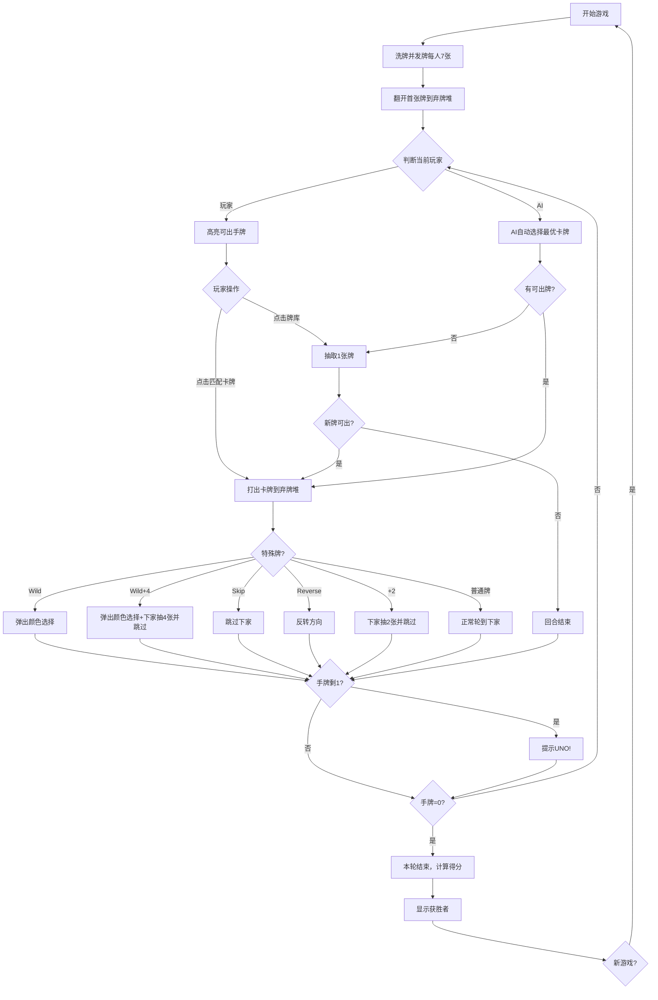

# UNO 卡牌游戏 - 产品需求文档

## 1. 产品概述

一个完整运行在浏览器端的 UNO 卡牌游戏。玩家与 2 个 AI 对手进行对战，遵循标准 UNO 规则，率先出完手中所有卡牌者获胜。

- **目标用户**：喜欢休闲卡牌游戏的玩家，对 UNO 规则有一定了解的桌游爱好者
- **核心价值**：无需安装、无需联网、打开即玩的纯浏览器端 UNO 体验

## 2. 核心功能

### 2.1 用户角色

| 角色 | 说明 |
|------|------|
| 玩家 | 真人操作，位于屏幕下方，点击卡牌出牌 |
| AI 对手 ×2 | 电脑自动决策，位于屏幕上方和左/右侧 |

### 2.2 功能模块

1. **游戏主界面**：手牌展示区、弃牌堆、牌库堆、对手信息、当前状态提示
2. **出牌系统**：点击匹配卡牌出牌、不合规提示、Wild 变色选择
3. **AI 系统**：AI 自动出牌决策，含简单策略（优先出数字牌、保留功能牌）
4. **计分与胜负**：每轮结束后计算得分，显示获胜者
5. **UNO 呼叫**：剩余 1 张牌时自动触发 UNO 提示
6. **新游戏**：可重新开始游戏

### 2.3 页面详情

| 页面名称 | 模块名称 | 功能描述 |
|----------|----------|----------|
| 游戏主界面 | 弃牌堆 | 显示当前弃牌堆顶部卡牌，作为匹配目标 |
| 游戏主界面 | 牌库堆 | 显示剩余牌库数量，点击可抽牌 |
| 游戏主界面 | 玩家手牌 | 底部居中展示，卡片扇形/水平排列，可点击出牌 |
| 游戏主界面 | AI 对手区 | 显示 AI 名称、剩余牌数、头像 |
| 游戏主界面 | 当前颜色指示 | 显示当前生效的颜色（Wild 后变色） |
| 游戏主界面 | 方向指示 | 显示当前出牌方向（顺/逆时针） |
| 游戏主界面 | 颜色选择器 | Wild/Wild+4 打出后弹出四色选择面板 |
| 游戏主界面 | 新游戏按钮 | 重置游戏状态 |

## 3. 核心流程

玩家进入游戏 → 自动洗牌发牌（每人 7 张）→ 翻开首张牌 → 按顺时针轮流：
- **玩家回合**：手牌中匹配弃牌堆颜色/数字/符号的卡牌高亮可点击 → 无可出牌则抽牌（点击牌库）
- **AI 回合**：自动判断并出牌，带 0.5-1.5 秒思考延迟
- 打出功能牌时触发对应效果（Skip/Reverse/+2/Wild/Wild+4）
- 剩 1 张牌时提示"UNO！"
- 任意玩家出完牌 → 本轮结束 → 显示得分 → 可开始新游戏

## 4. 用户界面设计

### 4.1 设计风格

- **主题**：暗色游戏桌面背景，模拟真实牌桌质感
- **主色调**：深绿色桌面基底 (#1a3a1a)，搭配 UNO 经典四色（红 #E53935、黄 #FDD835、蓝 #1E88E5、绿 #43A047）作为卡牌和 UI 点缀
- **卡牌风格**：CSS 纯渲染，白色底 + 圆角 + 阴影，数字/符号居中大字，左上/右下小角标
- **字体**：标题用 bold sans-serif，卡牌数字用粗体
- **动效**：卡牌悬浮放大、出牌飞入弃牌堆动画、UNO 呼叫声效视觉反馈
- **布局**：桌面居中布局，弃牌堆和牌库堆位于中央，玩家手牌底部，AI 上方

### 4.2 页面设计概览

| 页面名称 | 模块名称 | UI 元素 |
|----------|----------|---------|
| 游戏主界面 | 牌桌背景 | 深绿色渐变背景，模拟毛毡质感 |
| 游戏主界面 | 弃牌堆 | 中央偏左，大尺寸卡牌展示 |
| 游戏主界面 | 牌库堆 | 中央偏右，卡背堆叠展示 + 剩余数量 |
| 游戏主界面 | 玩家手牌 | 底部居中，扇形排列，悬停浮起，不可出牌半透明 |
| 游戏主界面 | AI 对手 | 上方左右各一，显示名称/牌数/头像 |
| 游戏主界面 | 颜色选择器 | 弹出四色圆形按钮，带动画过渡 |
| 游戏主界面 | 方向指示器 | 中央顶部箭头图标 |

### 4.3 响应式

- 桌面优先设计（1200px+ 最佳）
- 平板适配：手牌缩小，AI 区域紧凑
- 移动端：手牌堆叠可滑动，卡牌尺寸缩小

## 5. 完整 UNO 卡牌规格

### 5.1 牌组构成（108 张）

| 类型 | 颜色 | 数量 | 说明 |
|------|------|------|------|
| 数字牌 0 | 红/黄/蓝/绿 | 各1张，共4张 | 点数 0 |
| 数字牌 1-9 | 红/黄/蓝/绿 | 各2张，共72张 | 点数 1-9 |
| Skip（跳过） | 红/黄/蓝/绿 | 各2张，共8张 | 跳过下一位玩家 |
| Reverse（反转） | 红/黄/蓝/绿 | 各2张，共8张 | 反转出牌方向 |
| Draw Two（+2） | 红/黄/蓝/绿 | 各2张，共8张 | 下家抽2张并跳过 |
| Wild（万能） | - | 4张 | 任意变色 |
| Wild Draw Four（万能+4） | - | 4张 | 变色 + 下家抽4张并跳过 |

### 5.2 规则要点

- **出牌规则**：匹配弃牌堆顶部卡牌的颜色、数字或符号
- **无牌可出**：从牌库抽 1 张，若可出则立即打出，否则回合结束
- **UNO 呼叫**：剩 1 张牌时必须呼叫 UNO，漏叫罚抽 2 张（自动检测提示）
- **Wild+4 限制**：仅当手中无当前颜色卡牌时可打出（系统自动判断）
- **2 人特殊规则**：Reverse 等同于 Skip