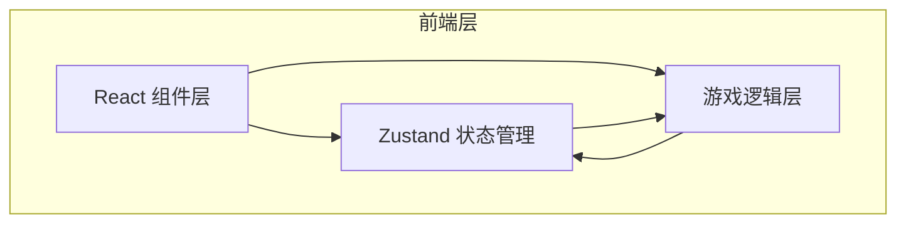

# UNO 卡牌游戏 - 技术架构文档

## 1. 架构设计

纯前端浏览器端应用，无后端服务。所有游戏逻辑在客户端运行。



## 2. 技术描述

- **前端框架**：React 18 + TypeScript（严格模式）
- **构建工具**：Vite
- **样式方案**：Tailwind CSS 3 + CSS Modules（卡牌等复杂样式）
- **状态管理**：Zustand
- **图标库**：lucide-react
- **无后端**：100% 浏览器端运行

## 3. 项目结构

```
src/
├── components/
│   ├── Card.tsx              # 单张卡牌组件
│   ├── CardBack.tsx          # 卡背组件
│   ├── PlayerHand.tsx        # 玩家手牌区
│   ├── AIHand.tsx            # AI 手牌区（显示牌背）
│   ├── DiscardPile.tsx       # 弃牌堆
│   ├── DrawPile.tsx          # 牌库堆
│   ├── ColorPicker.tsx       # 变色选择器
│   ├── GameBoard.tsx         # 游戏主面板
│   ├── GameInfo.tsx          # 游戏信息栏（方向、颜色）
│   ├── Scoreboard.tsx        # 计分板
│   └── UNOCall.tsx           # UNO 呼叫提示
├── hooks/
│   └── useGameEngine.ts      # 游戏引擎 Hook
├── store/
│   └── gameStore.ts          # Zustand 全局状态
├── utils/
│   ├── deck.ts               # 牌组创建与洗牌
│   ├── rules.ts              # 规则判断逻辑
│   ├── ai.ts                 # AI 决策逻辑
│   └── types.ts              # TypeScript 类型定义
├── pages/
│   └── GamePage.tsx          # 游戏页面
├── App.tsx
├── main.tsx
└── index.css
```

## 4. 核心数据模型

### 4.1 类型定义

```typescript
type CardColor = 'red' | 'yellow' | 'blue' | 'green';
type CardType = 'number' | 'skip' | 'reverse' | 'draw2' | 'wild' | 'wild4';

interface Card {
  id: string;
  color: CardColor | null; // null for wild cards
  type: CardType;
  value?: number; // 0-9 for number cards
}

type Direction = 'clockwise' | 'counterclockwise';

type GamePhase = 'idle' | 'playing' | 'color-picking' | 'round-over';

interface Player {
  id: string;
  name: string;
  hand: Card[];
  isHuman: boolean;
}

interface GameState {
  players: Player[];
  drawPile: Card[];
  discardPile: Card[];
  currentPlayerIndex: number;
  direction: Direction;
  currentColor: CardColor;
  phase: GamePhase;
  winner: Player | null;
  scores: number[];
  unoCallPending: boolean;
}
```

### 4.2 AI 决策策略

```
AI 出牌优先级：
1. 若有可匹配的普通数字牌 → 优先出
2. 若有可匹配的功能牌 → 出 Skip/Reverse 优先于 +2
3. 若有 Wild/Wild+4 → 保留到最后，除非只剩1张牌
4. 若无牌可出 → 抽牌
```

## 5. 路由定义

| 路由 | 用途 |
|------|------|
| / | 游戏主页面 |

## 6. GitHub Pages 部署

- **构建产物**：`npm run build` 输出静态文件到 `dist/` 目录
- **Vite base 配置**：`vite.config.ts` 中设置 `base: '/uno/'`（仓库名为 uno 时）
- **Hash 路由**：使用 `HashRouter` 替代 `BrowserRouter`，避免刷新 404
- **自动部署**：通过 GitHub Actions 在推送 main 分支时自动构建并部署到 gh-pages

```yaml
# .github/workflows/deploy.yml
name: Deploy to GitHub Pages
on:
  push:
    branches: [main]
jobs:
  deploy:
    runs-on: ubuntu-latest
    permissions:
      contents: write
    steps:
      - uses: actions/checkout@v4
      - uses: actions/setup-node@v4
        with:
          node-version: 20
      - run: npm ci
      - run: npm run build
      - uses: peaceiris/actions-gh-pages@v4
        with:
          github_token: ${{ secrets.GITHUB_TOKEN }}
          publish_dir: ./dist
```

## 7. 无外部依赖

本游戏不涉及任何外部 API、数据库或第三方服务。所有资源（卡牌样式）均通过 CSS 本地生成，部署后为纯静态站点，可运行于 GitHub Pages 或任何静态文件服务器。